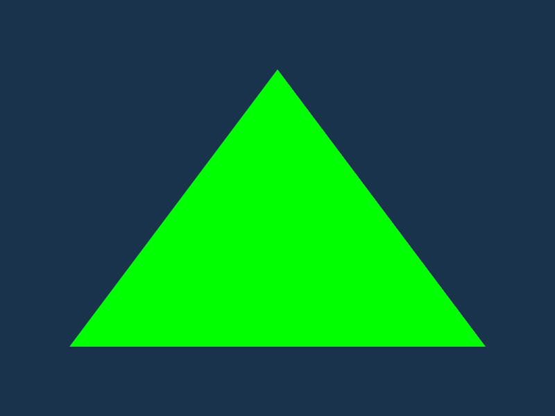

<h1 align="center">Nae</h1>
<div align="center">
 <strong>
   Cross platform multimedia layer made with Rust
 </strong>
</div>

<br />

## About
Nae is Not An Engine, is a portable multimedia layer with an easy API designed to make your own multimedia apps on top of it.

## Goals
- HTML5 must be a first class citizen using Webassembly.
- Support as many platforms as posible.
- Provide an abstraction layer to add new platforms easily (even privates like consoles). 
- Make easy to deploy on these platforms with a CLI.
- Provide an API that run on each platform without changes.

## Examples
```rust 
use nae::prelude::*;

#[nae_start]
fn main() {
    nae::init()
        .draw(draw)
        .build()
        .unwrap();
}

fn draw(app: &mut App, _: &mut ()) {
    let draw = app.draw();
    draw.begin();
    draw.set_color(Color::Green);
    draw.triangle(400.0, 100.0, 100.0, 500.0, 700.0, 500.0);
    draw.end();
}
```


**More examples**
- [Hello world](https://github.com/Nazariglez/nae/blob/master/examples/hello.rs)

## Getting started
Instructions to init and build a project

## Current state
- Targets
    - [ ] HTML
    - [ ] iOS
    - [ ] Android
    - [ ] MacOS
    - [ ] Linux 
    - [ ] Windows
- 2D renderer
    - [x] Primitives
    - [x] Polylines
    - [ ] SVGs
    - [x] Sprites
    - [x] Patterns
    - [x] Masking
    - [ ] Custom Shader
    - [ ] Text
    - [ ] BitmapText
    - [x] NineSlice
    - [ ] Linear Gradient
    - [ ] Radial Gradient
    - [ ] Atlas
    - [ ] BlendModes
- Drivers
    - [ ] WebGL
    - [ ] WebGL 2
    - [ ] Metal
    - [ ] Dx11
    - [ ] Dx12
    - [ ] Vulkan
    - [ ] OpenGL
    - [ ] OpenGL ES
- API 
    - [ ] Window
    - [ ] Keyboard
    - [ ] Mouse
    - [ ] Touch
    - [ ] Gamepad
    - [ ] Audio

## License
...

## Contribution
...
